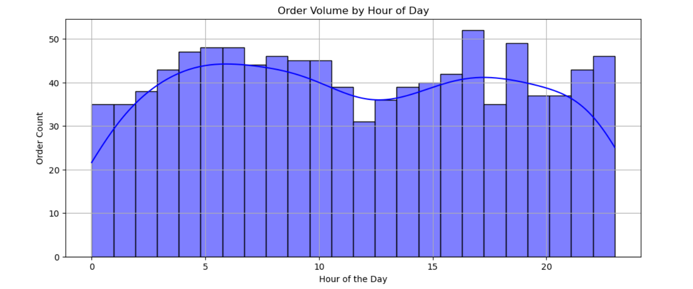

# Delhi Food Orders Analysis

This repository contains a data analysis project focused on **food orders from New Delhi**. The project leverages Python libraries like **Pandas**, **NumPy**, **Matplotlib**, and **Seaborn** to analyze trends, visualize insights, and uncover patterns in food order data.

## Project Overview

The primary objective of this project is to analyze food order data to understand customer preferences, peak order times, and popular cuisines in New Delhi. This analysis can provide insights for restaurants, food delivery platforms, and businesses seeking to improve customer satisfaction.

## Dataset

The dataset includes the following key features:

- **Order ID**: Unique identifier for each order
- **Date & Time**: Timestamp of the order
- **Cuisine Type**: Category of the food ordered
- **Order Value**: Total price of the order
- **Customer Location**: Area within New Delhi
- **Payment Method**: Mode of transaction (e.g., Cash, Online)

## Tools and Libraries Used

- **Python**
- **Pandas** (Data manipulation and analysis)
- **NumPy** (Numerical computing)
- **Matplotlib** (Data visualization)
- **Seaborn** (Statistical data visualization)

## Analysis Conducted

1. **Data Cleaning:**

   - Removed missing values and handled null entries.
   - Standardized date-time formats and categorized data points.

2. **Exploratory Data Analysis (EDA):**

   - Identified peak order hours and busiest days.
   - Analyzed top-performing cuisines and customer preferences.
   - Visualized trends using bar charts, histograms, and heatmaps.

3. **Insights & Findings:**

   - **Peak Hours:** Most orders are placed during lunch (1-3 PM) and dinner (7-9 PM).
   - **Popular Cuisine:** North Indian and Chinese cuisines are most ordered.
   - **Order Value Trends:** Higher-value orders are common in South Delhi.

## Visualizations

- **Daily Order Trends**: Analysis of order patterns across different weekdays.
- **Top Cuisine Preferences**: Identifying the most popular cuisines in Delhi.
- **Order Value Distribution**: Understanding the range and frequency of order values.
- **Peak Hour Analysis**: Highlighting the busiest order times.\
  
- **Payment Method Distribution**: Breakdown of cash versus online payments.

## How to Run the Project

1. Clone the repository:

   ```bash
   git clone https://github.com/yourusername/DelhiFoodOrdersAnalysis.git
   ```

2. Install dependencies:

   ```bash
   pip install pandas numpy matplotlib seaborn
   ```

3. Open the Jupyter Notebook:

   ```bash
   jupyter notebook
   ```

4. Run the notebook step-by-step to explore data insights.

## Future Improvements

- Adding machine learning models to predict order values.
- Exploring customer sentiment analysis using text data from reviews.

## Contributing

Contributions are welcome! Please feel free to submit a pull request or report issues.

## License

This project is licensed under the [MIT License](LICENSE).

---

Feel free to reach out if you have any questions or suggestions!

**Author:** [Lohith Sappa]\
**LinkedIn:** [LohithSappa](https://www.linkedin.com/in/lohith-sappa-aab07629a/)\
**Contact:** [sidhusidharth7075@gmail.com](mailto:sidhusidharth7075@gmail.com)
